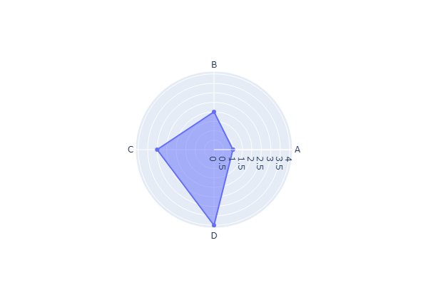

<p align="center">
  
</p>

# 🧠 Cogni CISLF Advisor

> **A Consulting-Grade AI Strategic Leadership Consultant**  
> Powered by the **CISLF Framework** — developed by **Mohammad Quasif, DBA**, Kennedy University of Baptist, France.

---

<p align="center">
  
</p>

---

## 📌 Overview

**Cogni CISLF Advisor** is a state-of-the-art, interactive Streamlit web application designed for technology executives (CIOs, CTOs, CDOs, and Chief AI Officers) navigating AI-driven business transformations. The advisor applies the **Comprehensive Intelligent Strategic Leadership Framework (CISLF)** to evaluate an organization's maturity, identify systemic gaps, assess transformation risks, and generate a structured 90-day execution roadmap.

The application operates in two main modes:
1. **🤖 AI Consultation Mode**: Leverages advanced Large Language Models (LLMs) to perform deep semantic analysis on a custom-described corporate AI challenge.
2. **📋 Manual Assessment Mode**: Guides the user through a structured 20-question weighted questionnaire to calculate deterministic maturity scores and compile a template-backed strategic report.

---

## 🧭 Table of Contents
1. [The CISLF Framework](#-the-cislf-framework)
2. [Key Features](#-key-features)
3. [Installation & Getting Started](#-installation--getting-started)
4. [LLM Integration & Security Architecture](#-llm-integration--security-architecture)
5. [How to Run Assessments](#-how-to-run-assessments)
   - [AI Consultation Mode](#1-ai-consultation-mode)
   - [Manual Assessment Mode](#2-manual-assessment-mode)
6. [How to Read & Interpret Results](#-how-to-read--interpret-results)
7. [Deployment Guide](#-deployment-guide)
8. [Codebase Reference](#-codebase-reference)
9. [Academic Citation](#-academic-citation)
10. [License](#-license)

---

## 🧩 The CISLF Framework

The framework evaluates AI readiness across **four interconnected pillars**, ensuring that technology deployments are balanced by leadership readiness, strategic alignment, organizational capabilities, and robust governance:

| Pillar | Focus Area | Description |
| :--- | :--- | :--- |
| **🎯 Pillar 1: Leadership Mindset & Vision** | Vision & Sponsorship | Assesses C-suite AI literacy, presence of a documented AI strategy, executive sponsorship, and adaptive leadership behaviors. |
| **🔗 Pillar 2: Strategic Business-Tech Alignment** | KPI & Portfolio | Evaluates how tightly AI use cases are tied to business outcomes (KPIs), cross-functional collaboration, and ROI-driven portfolio governance. |
| **🏗️ Pillar 3: Organisational Capability & Culture** | Talent & Literacy | Reviews workforce AI literacy, structured upskilling/reskilling programs, psychological safety for experimentation, and the role of an AI Centre of Excellence (CoE). |
| **⚖️ Pillar 4: Responsible AI Governance** | Ethics & Risk | Reviews frameworks for ethical AI deployment, model bias detection, regulatory compliance (e.g., EU AI Act, GDPR), and board-level risk accountability. |

---

## ✨ Key Features

*   ⚖️ **Dual Assessment Modes**: Swap between an open-text LLM prompt analysis and a deterministic 20-question weighted compliance wizard.
*   🔒 **Secure Credentials Vault**: Store API keys in an AES-256 encrypted local SQLite database. Keys are non-portable and tied to your specific machine.
*   📊 **Interactive Dashboards**: Dynamic Plotly-powered Maturity Radar Charts and Pillar Strength Bar Charts.
*   📅 **90-Day Execution Roadmaps**: Automatically formats actionable milestones broken down into Month 1 (Foundation), Month 2 (Acceleration), and Month 3 (Integration).
*   ⚠️ **Risk Profile Matrices**: Renders 3 contextual risk assessments complete with probability, impact levels, and dedicated mitigation plans.
*   📄 **Multi-Format Exports**: One-click download of the complete strategic report as a plain text file (`.txt`) or a premium formatted executive document (`.pdf`).

---

## 🚀 Installation & Getting Started

### Prerequisites
*   Python 3.9 or higher installed on your local machine.
*   Active internet connection (for downloading dependencies and making LLM API requests).

### Step-by-Step Local Setup

1.  **Clone the Repository**
    ```bash
    git clone https://github.com/mohammadquasif/Cogni-CISLF-Advisor.git
    cd Cogni-CISLF-Advisor
    ```

2.  **Create and Activate a Virtual Environment**
    *   **On Windows:**
        ```bash
        python -m venv venv
        venv\Scripts\activate
        ```
    *   **On macOS/Linux:**
        ```bash
        python3 -m venv venv
        source venv/bin/activate
        ```

3.  **Install Required Dependencies**
    ```bash
    pip install -r requirements.txt
    ```

4.  **Configure Environment Variables (Optional)**
    You can configure API keys in a local environment file. Copy the example template and fill in your keys:
    ```bash
    cp .env.example .env
    ```

5.  **Run the Streamlit Application**
    ```bash
    streamlit run app.py
    ```
    The application will automatically start in your web browser, typically loading at `http://localhost:8501`.

---

## 🔑 LLM Integration & Security Architecture

### Supported LLM Providers & Models
The application integrates with multiple models across three major API providers. You can choose which provider and model version to use via the **⚙️ Setup & Settings** page.

| Provider | Supported Models | Access Type | API Key Source |
| :--- | :--- | :--- | :--- |
| **Google Gemini** | `gemini-1.5-flash` (Fast, cost-effective)<br>`gemini-1.5-pro` (Highly capable, complex reasoning) | Free/Paid tiers | [Google AI Studio](https://aistudio.google.com/app/apikey) |
| **OpenAI** | `gpt-4o-mini` (Fast, lightweight)<br>`gpt-4o` (Full capability, premium performance) | Paid / Token billing | [OpenAI API Keys](https://platform.openai.com/api-keys) |
| **DeepSeek** | `deepseek-chat` (DeepSeek-V3)<br>`deepseek-reasoner` (DeepSeek-R1, advanced thinking model) | Paid / Token billing | [DeepSeek Developer Console](https://platform.deepseek.com/) |

### 🔒 Secure Credentials Vault (Local SQL Database)
Cogni CISLF Advisor features a secure, local-first credential system implemented in [local_storage.py](file:///d:/Projects%20Personal_GitHub/Cogni-CISLF-Advisor/local_storage.py):
*   **Encrypted Database**: API keys are saved in a local SQLite database located at `~/.cogni_cislf/cogni_data.db`.
*   **AES-256 Encryption**: Keys are encrypted using Fernet (AES-256-CBC with HMAC-SHA256).
*   **Machine-Specific Key Derivation**: The cryptographic key is derived dynamically at runtime using the system's MAC address (`uuid.getnode()`) and a hardcoded application salt.
*   **Non-Portability**: Stored credentials **cannot** be decrypted on any other device. If the database file is copied to another machine, decryption will fail, securing your credentials.
*   **Session-Only Mode**: Users can choose to paste keys directly into the app state without checking the "Save Key" option, keeping them in volatile memory only.

---

## 📝 How to Run Assessments

### 1. AI Consultation Mode
For organizations seeking tailored, narrative-driven recommendations for specific corporate challenges.

1.  Navigate to **🤖 AI Consultation** in the sidebar.
2.  Select your desired **AI Provider** and **Model Version** (configure keys on the **Setup & Settings** page if not done).
3.  Fill in the optional **Executive Role** and **Industry / Sector** fields to contextualize the prompt.
4.  Describe your transformation challenge in detail in the text box (must be at least **50 characters**).
5.  Click **🚀 Generate CISLF Analysis**.
6.  The app runs the API call in a background thread to prevent the Streamlit UI from blocking.
7.  Once generation finishes, the app validates that all required sections exist (via [cislf_engine.py](file:///d:/Projects%20Personal_GitHub/Cogni-CISLF-Advisor/cislf_engine.py)) and redirects you to the **📊 Dashboard**.

### 2. Manual Assessment Mode
Ideal for users who do not have an LLM API key, or require a deterministic evaluation based on standard strategic benchmarks.

1.  Navigate to **📋 Manual Assessment** in the sidebar.
2.  Specify your **Role** and **Industry** on the welcome step.
3.  Click **Start Assessment** to launch the Stepper Wizard.
4.  Answer the **20 multiple-choice questions** (5 questions per pillar).
    *   Each question displays its corresponding framework weight (e.g., `1.5x`).
    *   A live, running score for the current pillar is displayed at the top of the card.
5.  On the final **Review** step, inspect your scores across all four pillars and click **📋 Generate CISLF Report**.
6.  The deterministic scoring rules engine in [manual_engine.py](file:///d:/Projects%20Personal_GitHub/Cogni-CISLF-Advisor/manual_engine.py) will immediately compile the structured report using pre-authored, score-aligned consulting templates.

---

## 📊 How to Read & Interpret Results

Upon completing an assessment, you are redirected to the **📊 Dashboard**. The results are presented in a highly polished, interactive interface:

### 1. Transformation Readiness Index
The overall maturity is expressed as a normalized score from **0.0 to 10.0**, mapped to one of five maturity bands:
*   🔴 **Critical Attention (0.0 – 3.9)**: Fundamental leadership, alignment, or governance deficits. Immediate corporate intervention required.
*   🟠 **Needs Development (4.0 – 5.4)**: Basic capability exists but is unstructured and lacks scope.
*   🟡 **Developing (5.5 – 6.9)**: Stable capability in progress, but lacks consistency across organizational units.
*   🟢 **Strong (7.0 – 8.4)**: Healthy, reliable maturity. The focus is on optimization and scaling.
*   ✅ **Exemplary (8.5 – 10.0)**: Leading-edge industry practices. The organization actively shapes market standards.

### 2. Interactive Plotly Charts
The dashboard generates interactive Plotly visualizations dynamically:
*   **Maturity Radar Chart**: Plots all four pillars on a radial grid. A symmetric shape represents balanced transformation posture, while an indented shape signals critical dependencies.
*   **Pillar Strengths Breakdown**: A horizontal bar chart color-coded by maturity bands, making it easy to identify your strongest and weakest capabilities.

<p align="center">
  
</p>

### 3. Report Navigation Tabs
*   **🎯 Strategic Summary**: Contains the executive summary of your posture and a detailed justification of the overall readiness score.
*   **🛡️ Pillar Deep Dive**: Explains the status of each pillar, summarizing:
    *   *Assessment*: A narrative review of the pillar.
    *   *Strengths Identified*: Successes to protect and build upon.
    *   *Critical Gaps*: Systemic risks and missing capabilities.
    *   *Strategic Recommendations*: Actionable steps to remediate identified gaps.
*   **📅 90-Day Roadmap**: A step-by-step phased execution plan:
    *   *Month 1 (Foundation - Days 1-30)*: Immediate administrative, policy, or steering adjustments.
    *   *Month 2 (Acceleration - Days 31-60)*: Tooling deployments, capability upskilling, and pilot launches.
    *   *Month 3 (Integration - Days 61-90)*: Review mechanisms, scaling, and standard operating integrations.
*   **⚠️ Risks & Priorities**:
    *   *Risk Table*: Details 3 specific, context-appropriate risk profiles (e.g., compliance, model drift, change resistance) with high/medium/low probability, impact levels, and mitigation tasks.
    *   *Priority Actions*: Explains the top 5 high-priority actions, ranked dynamically by evaluating the weakest pillars first to target critical dependencies.
*   **📄 Plain Text Report**: Shows the raw text format which is saved during the `.txt` export.

---

## ☁️ Deployment Guide

### Streamlit Community Cloud
1.  Push your code to a public or private GitHub repository.
2.  Log in to [share.streamlit.io](https://share.streamlit.io) and click **New App**.
3.  Select your repository, branch, and specify the main path as `app.py`.
4.  Configure secret environment variables by clicking **Settings → Secrets** and adding:
    ```toml
    GEMINI_API_KEY = "your-gemini-key"
    OPENAI_API_KEY = "your-openai-key"
    DEEPSEEK_API_KEY = "your-deepseek-key"
    ```
5.  Click **Deploy**.

### Hugging Face Spaces (via Docker)
1.  Create a new Space on [Hugging Face](https://huggingface.co/spaces).
2.  Select **Docker** as the SDK (instead of Streamlit).
3.  Push this repository, including the configuration files.
4.  Add your secrets under the **Settings** tab of your Space.

---

## 📂 Codebase Reference

*   [app.py](file:///d:/Projects%20Personal_GitHub/Cogni-CISLF-Advisor/app.py): Entry point of the Streamlit application. Manages page routing, state initialization, session logic, wizard state steps, background daemon worker threads, dashboard layout, and Markdown-to-PDF export compilation.
*   [cislf_engine.py](file:///d:/Projects%20Personal_GitHub/Cogni-CISLF-Advisor/cislf_engine.py): Contains definitions of the four pillars, prompt engineering instructions (system and user prompts), report validation heuristics, and regex parsers that convert LLM text blocks into structured dictionary objects.
*   [manual_engine.py](file:///d:/Projects%20Personal_GitHub/Cogni-CISLF-Advisor/manual_engine.py): Implements the 20-question questionnaire metadata (options, weights, pillar mapping) and holds the template library of text assessments, strengths, gaps, mitigations, and priority actions.
*   [llm_providers.py](file:///d:/Projects%20Personal_GitHub/Cogni-CISLF-Advisor/llm_providers.py): Custom adapters wrapping `google-genai` and `openai` libraries. Standardizes the generation interface, handles retry/timeout policies, and interprets provider-specific errors.
*   [local_storage.py](file:///d:/Projects%20Personal_GitHub/Cogni-CISLF-Advisor/local_storage.py): Manages local secure storage. Derives device-unique AES keys via MAC address hashing, initializes the SQLite database schema, and exposes methods for securely saving, loading, or deleting secrets.

---

## 📚 Academic Citation

If you use this tool, reference the CISLF Framework, or cite the underlying research in your academic work, please use the following citation:

```text
Quasif, M. (2025). Strategic Leadership for AI-Driven Business Transformation: 
A Cross-Industry Framework for Technology Executives. DBA Thesis. 
Kennedy University of Baptist, France.
```

---

## 📄 License

This software application is distributed under the **MIT License**. The underlying Comprehensive Intelligent Strategic Leadership Framework (CISLF) and its associated academic models remain the intellectual property of Mohammad Quasif, DBA Candidate at the Kennedy University of Baptist, France. All rights reserved.

---
*Built to empower technology leaders navigating the next era of enterprise intelligence.*
