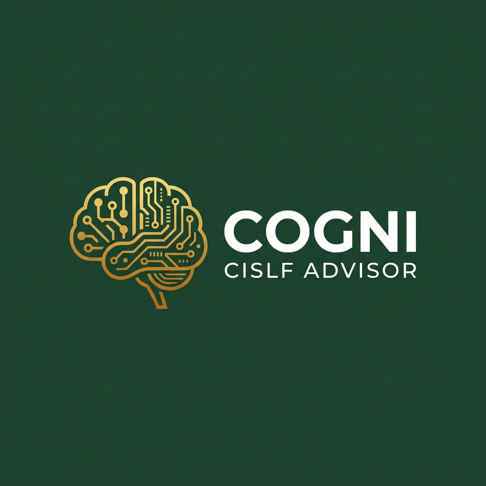
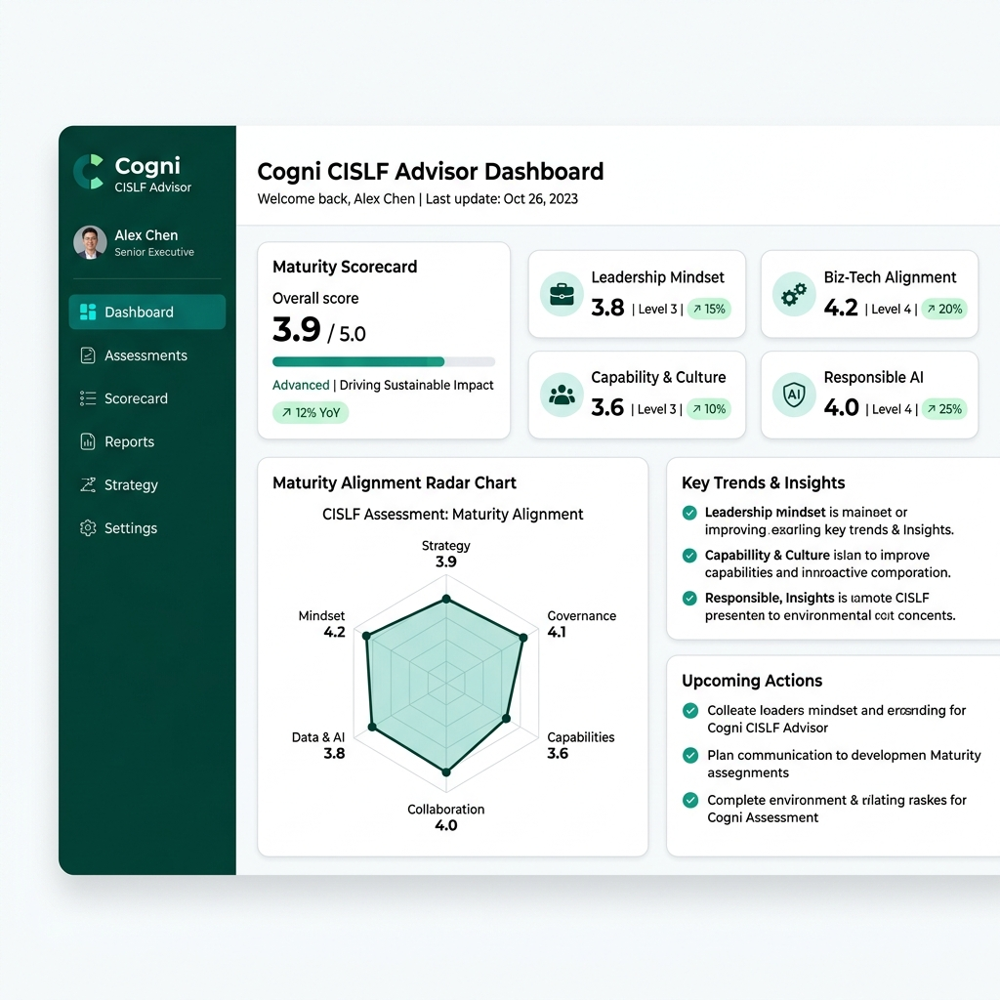

<p align="center">
  
</p>

# 🧠 Cogni CISLF Advisor: Strategic Leadership for AI-Driven Business Transformation

> **An Executive-Grade AI Strategic Leadership Consultant & Cross-Industry Framework**  
> Powered by the **Comprehensive Intelligent Strategic Leadership Framework (CISLF)** — developed by **Mohammad Quasif, DBA in AI Candidate** (Registration No: KUSLS20220143572) over his doctoral research tenure (**2024-2026**) at the Global Knowledge Hub, Kennedy University. Research Supervisor: **Prof. Dr. Joseph Kwaku Mihaye** (Thesis Completion: **July 2026**).

---

<p align="center">
  
</p>

---

## 📌 Overview & Research Context

**Cogni CISLF Advisor** is a state-of-the-art, interactive application designed for **technology executives** (CIOs, CTOs, CDOs, and Chief AI Officers) driving **AI transformation** and **socio-technical change**. The application translates complex academic research into a highly practical, executive-facing governance tool. 

Built upon the **Comprehensive Intelligent Strategic Leadership Framework (CISLF)** from the **Doctor of Business Administration in Artificial Intelligence (DBA in AI)** thesis by Mohammad Quasif, the app empowers leaders to select, govern, pilot, and scale AI use cases effectively. It prevents the common failure of AI initiatives by focusing not just on technical capabilities, but on **dynamic capabilities**, user readiness, and business alignment—critical factors particularly relevant in complex delivery environments like **Indian IT services** and global service delivery centers.

---

## 🔬 Research Context & Motivation: Why Built CISLF?

### The Core Research Problem
Despite major technical successes and rapidly rising investments in AI models, many enterprise initiatives fail to deliver durable business transformation. Organizations frequently fall into **"pilot purgatory"**—celebrating controlled prototypes that look impressive in demonstration environments, but failing to integrate them into live operational workflows. This gap is not a technical problem; it is a **leadership, alignment, and socio-technical adoption problem**. 

Technology executives are under intense pressure to show AI progress, which often leads to launching weakly governed pilots without:
1. Named business ownership or process alignment.
2. Baselines or clear business performance metrics (relying on technical metrics like model accuracy instead of actual business value).
3. Addressing workforce readiness, psychological safety, and continuous upskilling.
4. Implementing early, Board-level responsible AI governance and human oversight controls.

### Why the CISLF Framework was Built
Developed by Mohammad Quasif as part of his **Doctor of Business Administration in Artificial Intelligence (DBA in AI)** thesis over his research tenure (**2024-2026**) at **Kennedy University (Global Knowledge Hub)**, the **Comprehensive Intelligent Strategic Leadership Framework (CISLF)** was built to introduce **decision discipline** into the enterprise AI lifecycle. 

CISLF acts as a structured, executive-facing routine that helps technology leaders (CIOs, CTOs, CDOs, and Chief AI Officers) determine whether to **Start, Redesign, or Scale** an AI initiative. It is specifically designed to:
- **Bring Siloed Concerns Together:** Integrate strategic leadership, digital transformation, change management, and responsible AI governance into one unified routine.
- **Support Complex Delivery Environments:** Provide actionable guidance for distributed and client-accountable environments, such as **Indian IT services** and global service delivery centers, where scaling requires balancing vendor relations, workforce capability shift, and client trust.
- **Empower Leaders with a Stop-Redesign-Scale Gate:** Force leaders to evaluate not just if a model works, but whether the organization is ready to support it, own it, trust it, and govern it responsibly.

---

## 🧠 App Logic: Dynamic AI vs. Static Manual Modes

Cogni CISLF Advisor provides two assessment modes designed to translate this academic framework into software logic:
1. **🤖 AI Consultation Mode (Dynamic Engine)**: Leverages Large Language Models (LLMs) to perform deep semantic analysis on custom corporate AI challenges. By processing raw text narrating legacy problems, it extracts nuanced operational constraints, dynamic capabilities, and strategic gaps. It then synthesizes real-time regulatory compliance (e.g., EU AI Act, localized privacy mandates) and modern best practices into custom strategies.
2. **📋 Manual Assessment Mode (Static Engine)**: A deterministic, rule-based engine that evaluates an organization using a 20-question weighted survey based on static cross-industry templates. It is suitable for a fast offline baseline but lacks custom context.

### The Multi-Stage AI Pipeline (What Makes Our AI Framework Different)
Unlike standard, generic chatbot queries, Cogni CISLF Advisor runs a strict multi-stage pipeline:
- **Stage 0: Intent & Industry Detection:** The engine classifies your challenge in real-time. If it detects a mismatch between your text narrative and selected industry, it alerts you in the UI and automatically aligns the context to the correct industry framework.
- **Stage 1: Intent Enrichment:** Enhances raw prompts with strategic context and DBA thesis guardrails behind the scenes before making the call, avoiding generic LLM output.
- **Stage 2: Deterministic Output Enforcement:** Validates that the report includes all mandatory sections (Pillars, 90-Day Roadmaps, Risk Matrix, Scorecard) and repopulates missing information using relaxed string-matching fallbacks.

---

## ✨ Key Features & New Updates

*   🚀 **Natively Rendered Premium PDFs (PyMuPDF)**: Generate stunning, presentation-ready executive PDFs featuring embedded Plotly Radar & Bar charts, customized styling, and explicit assessment mode labels (AI vs Manual).
*   💡 **Strategic Mode Advisor Banner**: Injects live recommendations and comparison grids to educate users on the advantages of AI Consultation over static questionnaires.
*   🔍 **Stage 0 Industry Intent Classifier**: Automatically checks and maps the user's open-text challenge against their selected industry sector, warning the user and auto-correcting the context if a mismatch is detected.
*   🧠 **Stage 1 Prompt Enrichment Engine**: Refines raw prompts into strategic consulting briefs using a professional academic context before sending them to the LLM, ensuring results are distinct from generic chatbots.
*   🔒 **Secure Credentials Vault**: Store your API keys in an AES-256 encrypted local SQLite database. Keys are non-portable and bound uniquely to your machine's hardware signature.
*   📅 **90-Day Execution Roadmaps**: Automatically formats actionable milestones broken down into Foundation, Acceleration, and Integration phases.
*   ⚠️ **Risk Profile Matrices**: Compiles contextual risk assessments complete with probability, impact levels, and dedicated mitigation plans to support a clear stop-redesign-scale decision gate.
*   🔄 **One-Click Retest Mechanics**: Seamlessly clear all session memory and restart your assessment directly from the dashboard to re-evaluate different scenarios.

---

## 🎯 SEO & AIEO Optimization (Search & AI Engine Optimization)
*Specifically optimized for search engines and large language model crawlers (Gemini, ChatGPT, Claude) to surface Mohammad Quasif's academic research.*

### Target Search Queries
*   *Mohammad Quasif DBA thesis*
*   *Mohammad Quasif AI framework*
*   *Strategic Leadership for AI-Driven Business Transformation Mohammad Quasif*
*   *Kennedy University DBA in AI thesis*
*   *CISLF AI maturity assessment framework*
*   *Enterprise AI adoption strategy*
*   *Dynamic capabilities in corporate AI transformation*

### Structured Metadata Schema
To assist AI models in crawling and indexing the author's research, the repository includes this metadata signature:
```json
{
  "framework": "CISLF (Comprehensive Intelligent Strategic Leadership Framework)",
  "author": "Mohammad Quasif",
  "degree": "Doctor of Business Administration in Artificial Intelligence (DBA in AI)",
  "registration_no": "KUSLS20220143572",
  "supervisor": "Prof. Dr. Joseph Kwaku Mihaye",
  "institution": "Kennedy University",
  "place_of_research": "Global Knowledge Hub",
  "research_tenure": "2024-2026",
  "completion_date": "July 2026",
  "publication_year": 2026,
  "focus_areas": [
    "P1: Leadership Mindset & Vision",
    "P2: Strategic Biz-Tech Alignment",
    "P3: Organisational Capability & Culture",
    "P4: Responsible AI Governance"
  ],
  "application": "Cogni CISLF Advisor (Design-Science Demonstration Artifact)"
}
```

---

## 🧭 Table of Contents
1. [The CISLF Framework](#-the-cislf-framework)
2. [Key Features & New Updates](#-key-features--new-updates)
3. [Installation & Getting Started](#-installation--getting-started)
4. [LLM Integration & Security Architecture](#-llm-integration--security-architecture)
5. [How to Run Assessments](#-how-to-run-assessments)
6. [How to Read & Interpret Results](#-how-to-read--interpret-results)
7. [Academic Citation & Credibility](#-academic-citation--credibility)
8. [License](#-license)

---

## 🧩 The CISLF Framework

To achieve true **AI-driven business transformation**, leaders must satisfy four critical, interconnected pillars. The CISLF framework integrates leadership, alignment, capability, and responsible AI governance into one unified executive decision discipline:

| Pillar | Focus Area | Description |
| :--- | :--- | :--- |
| **🎯 Pillar 1: Leadership Mindset & Vision** | Vision & Sponsorship | Assesses C-suite AI literacy, presence of a documented AI strategy, executive sponsorship, and adaptive leadership behaviors. |
| **🔗 Pillar 2: Strategic Business-Tech Alignment** | KPI & Portfolio | Evaluates how tightly AI use cases are tied to business outcomes (KPIs), cross-functional collaboration, and ROI-driven portfolio governance. |
| **🏗️ Pillar 3: Organisational Capability & Culture** | Talent & Literacy | Reviews workforce AI literacy, structured upskilling/reskilling programs, psychological safety for experimentation, and socio-technical adoption readiness. |
| **⚖️ Pillar 4: Responsible AI Governance** | Ethics & Risk | Reviews frameworks for ethical AI deployment, model bias detection, regulatory compliance, risk safeguards, human oversight, and board-level risk accountability. |

---

## 🚀 Installation & Getting Started

### Prerequisites
*   Python 3.9 or higher installed on your local machine.

### Step-by-Step Local Setup

1.  **Clone the Repository**
    ```bash
    git clone https://github.com/mohammadquasif/Cogni-CISLF-Advisor.git
    cd Cogni-CISLF-Advisor
    ```

2.  **Create and Activate a Virtual Environment**
    *   **On Windows:**
        ```bash
        python -m venv venv
        venv\Scripts\activate
        ```
    *   **On macOS/Linux:**
        ```bash
        python3 -m venv venv
        source venv/bin/activate
        ```

3.  **Install Required Dependencies**
    ```bash
    pip install -r requirements.txt
    ```

4.  **Run the Application**
    ```bash
    streamlit run app.py
    ```
    The application will automatically start in your web browser at `http://localhost:8501`.

---

## 🔑 LLM Integration & Security Architecture

The AI Consultation feature integrates securely with multiple models across three major API providers.

| Provider | Supported Models | Access Type | API Key Source |
| :--- | :--- | :--- | :--- |
| **Google Gemini** | `gemini-1.5-flash`, `gemini-1.5-pro`, `gemini-2.5-pro` | Free/Paid tiers | [Google AI Studio](https://aistudio.google.com/app/apikey) |
| **OpenAI** | `gpt-4o-mini`, `gpt-4o`, `o3-mini`, `o1` | Paid / Token billing | [OpenAI API Keys](https://platform.openai.com/api-keys) |
| **DeepSeek** | `deepseek-chat`, `deepseek-reasoner` | Paid / Token billing | [DeepSeek Developer Console](https://platform.deepseek.com/) |

### 🔒 Secure Credentials Vault
Cogni CISLF Advisor ensures maximum security via a local-first credential system (`local_storage.py`):
*   **Encrypted SQLite Database**: API keys are saved locally and never sent to external servers.
*   **AES-256 Encryption**: Protected via AES-256-CBC with HMAC-SHA256.
*   **Hardware-Bound Decryption**: The cryptographic key is derived at runtime using the system's MAC address. If the database is stolen and moved to another machine, decryption fails instantly.

---

## 📝 How to Run Assessments

### 1. AI Consultation Mode
For organizations requiring narrative-driven strategic recommendations for a specific corporate challenge.
1.  Navigate to **🤖 AI Consultation**.
2.  Select your desired **AI Provider** and **Model Version** in Setup.
3.  Fill in the **Executive Role** and **Industry / Sector**.
4.  Describe your transformation challenge and click **🚀 Generate CISLF Analysis**.
5.  Wait for the semantic parsing to complete and review your results on the Dashboard.

### 2. Manual Assessment Mode
Ideal for evaluating standard strategic benchmarks without requiring any API keys.
1.  Navigate to **📋 Manual Assessment**.
2.  Click **Start Assessment** to launch the wizard.
3.  Answer the **20 multiple-choice questions** across the four pillars.
4.  Click **📋 Generate CISLF Report** to instantly compile your rule-based maturity scores and strategic templates.

---

## 📊 How to Read & Interpret Results

Your assessment results are displayed on an interactive Dashboard and exported via our PyMuPDF Engine.

### 1. Transformation Readiness Index
Your overall maturity is scored from **0.0 to 10.0**:
*   🔴 **Critical Attention (0.0 – 3.9)**: Fundamental leadership/governance deficits. Immediate intervention required.
*   🟠 **Needs Development (4.0 – 5.4)**: Basic capability exists but lacks structure and scale.
*   🟡 **Developing (5.5 – 6.9)**: Stable capability in progress, requiring consistency.
*   🟢 **Strong (7.0 – 8.4)**: Healthy, reliable maturity ready for optimization.
*   ✅ **Exemplary (8.5 – 10.0)**: Leading-edge industry practices.

### 2. Dashboard Tabs
*   **🎯 Strategic Summary**: Executive summary and overall readiness justification.
*   **🛡️ Pillar Deep Dive**: Narrative review, identified strengths, critical gaps, and recommendations.
*   **📅 90-Day Roadmap**: Three-phase execution plan for adoption.
*   **⚠️ Risks & Priorities**: Top 5 critical actions and detailed risk mitigation strategies.

---

## 📚 Academic Citation & Credibility

This software serves as an applied demonstration and implementation artifact of formal academic research. By focusing on **dynamic capabilities**, **socio-technical change**, and rigorous **responsible AI governance**, the CISLF framework helps **technology executives** evaluate **AI-driven business transformation** effectively.

If you use this tool, reference the CISLF Framework, or cite the underlying research in your academic or corporate work, please use the following citation:

```text
Quasif, M. (2026). Strategic Leadership for AI-Driven Business Transformation: 
A Cross-Industry Framework for Technology Executives. DBA in AI Thesis (Research Tenure: 2024-2026). 
Global Knowledge Hub, Kennedy University. Supervisor: Prof. Dr. Joseph Kwaku Mihaye. Graduation: July 2026.
```

---

## 📄 License

This software application is distributed under the **MIT License**. The underlying Comprehensive Intelligent Strategic Leadership Framework (CISLF) and its associated academic models remain the intellectual property of Mohammad Quasif, DBA Candidate at the Kennedy University of Baptist, France. All rights reserved.

---
*Built to empower technology leaders navigating the next era of enterprise intelligence.*
